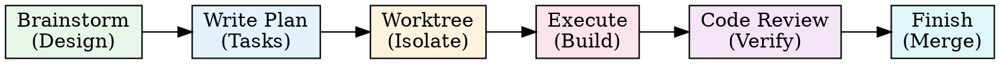

# Superpowers Deep Dive Guide

> Tài liệu nghiên cứu toàn diện về `obra/superpowers` — plugin biến Claude Code thành một engineering workflow engine hoàn chỉnh.

**Version:** 5.0.2 | **Author:** Jesse Vincent (obra) | **Repo:** https://github.com/obra/superpowers | **License:** MIT

---

## Mục lục

1. [Tổng quan & Triết lý](#1-tổng-quan--triết-lý)
2. [Kiến trúc hệ thống](#2-kiến-trúc-hệ-thống)
3. [Cài đặt](#3-cài-đặt)
4. [Workflow cốt lõi](#4-workflow-cốt-lõi)
5. [Skills chi tiết](#5-skills-chi-tiết)
6. [Agents](#6-agents)
7. [Hooks & Session Lifecycle](#7-hooks--session-lifecycle)
8. [Subagent Architecture](#8-subagent-architecture)
9. [Visual Brainstorming](#9-visual-brainstorming)
10. [Testing & Quality](#10-testing--quality)
11. [Viết Skill hiệu quả](#11-viết-skill-hiệu-quả)
12. [Multi-Platform Support](#12-multi-platform-support)
13. [Best Practices](#13-best-practices)
14. [So sánh với ECC & claude-mem](#14-so-sánh-với-ecc--claude-mem)

---

## 1. Tổng quan & Triết lý

### Superpowers là gì?

Superpowers là **plugin cho Claude Code** (và Cursor, Codex, Gemini CLI, OpenCode) biến AI coding agent thành một hệ thống engineering có kỷ luật. Nó không thêm capabilities mới — nó **enforce workflows** để Claude Code làm việc đúng cách.

### Vấn đề Superpowers giải quyết

Claude Code mặc định sẽ:
- Nhảy thẳng vào code khi nhận task (skip design)
- Không check existing skills/patterns trước
- Viết code trước test (skip TDD)
- Không isolate worktree (work trên main)
- Không review plan trước khi implement

Superpowers **enforce** một pipeline: **Brainstorm → Plan → Execute → Review → Finish**.

### Triết lý cốt lõi

**1. Skills là documentation có enforcement**
Skills không phải "nice to have". Superpowers dùng `<EXTREMELY_IMPORTANT>` blocks, authority language ("YOU MUST"), commitment sequences, và rationalization tables để **buộc** Claude tuân thủ.

**2. Test documentation giống test code (TDD cho Skills)**
Mỗi skill được test bằng pressure scenarios — đặt agent vào tình huống muốn vi phạm rule, xem nó có tuân thủ không. RED-GREEN-REFACTOR cycle applied cho documentation.

**3. Context là tài nguyên hữu hạn**
Mỗi token trong skill phải justify sự tồn tại. "Does Claude really need this?" Default: Claude đã rất smart — chỉ thêm cái Claude chưa biết.

**4. Subagent isolation**
Subagents nhận ĐÚNG context chúng cần, không thừa. Context window pollution = quality giảm.

### Scale

| Metric | Số lượng |
|--------|---------|
| Skills | 12 (core workflow + debugging + writing) |
| Agents | 2 (code-reviewer, plan-reviewer) |
| Hooks | 1 (SessionStart) |
| Supporting files | ~40 (.md, .js, .sh, .json) |
| Total lines | ~20,000 |
| Platforms | 5 (Claude Code, Cursor, Codex, Gemini CLI, OpenCode) |

---

## 2. Kiến trúc hệ thống

### Component Map

```
superpowers/
├── .claude-plugin/              # Claude Code plugin manifest
│   ├── plugin.json              # Name, version, description
│   └── marketplace.json         # Marketplace listing
├── .cursor-plugin/              # Cursor plugin manifest
│   └── plugin.json
├── .codex/                      # Codex support
│   └── INSTALL.md
├── .opencode/                   # OpenCode support
│   └── plugins/
├── hooks/                       # Lifecycle hooks
│   ├── hooks.json               # Hook definitions
│   └── session-start            # SessionStart script (polyglot)
├── skills/                      # The core — 12 skills
│   ├── using-superpowers/       # Meta: how to use skills
│   ├── brainstorming/           # Design phase
│   ├── writing-plans/           # Plan phase
│   ├── subagent-driven-development/  # Execute phase (with subagents)
│   ├── executing-plans/         # Execute phase (without subagents)
│   ├── dispatching-parallel-agents/  # Parallel execution
│   ├── requesting-code-review/  # Review phase
│   ├── finishing-a-development-branch/  # Finish phase
│   ├── using-git-worktrees/     # Workspace isolation
│   ├── test-driven-development/ # TDD enforcement
│   ├── systematic-debugging/    # Debug methodology
│   └── writing-skills/          # Meta: how to write skills
├── agents/                      # Agent definitions
│   ├── code-reviewer.md
│   └── plan-reviewer.md
├── commands/                    # Slash commands (deprecated)
│   ├── brainstorm.md
│   ├── write-plan.md
│   └── execute-plan.md
├── CLAUDE.md                    # Claude Code instructions
├── GEMINI.md                    # Gemini CLI instructions
├── README.md                    # Documentation
└── RELEASE-NOTES.md             # Changelog (v2.0 → v5.0.2)
```

### Workflow Pipeline



### Data Flow (1 Feature)

```
1. User: "Build auth system"
2. using-superpowers: Intercepts → routes to brainstorming
3. brainstorming:
   - Explore project context (files, existing code)
   - Ask questions one at a time
   - Optional: visual companion (browser mockups)
   - Write design doc → docs/superpowers/specs/YYYY-MM-DD-auth-design.md
   - Dispatch spec reviewer subagent → iterate until approved
   - User approves design
4. writing-plans:
   - Read design doc
   - Map files & responsibilities
   - Write chunked plan → docs/superpowers/plans/YYYY-MM-DD-auth.md
   - Dispatch plan reviewer subagent per chunk
5. using-git-worktrees:
   - Create .worktrees/feature/auth
   - Verify .gitignore covers it
   - Run tests → clean baseline
6. subagent-driven-development (or executing-plans):
   - For each task: dispatch implementer subagent
   - After each: dispatch spec-compliance reviewer
   - Then: dispatch code-quality reviewer
   - Loop until approved
7. requesting-code-review:
   - Dispatch code-reviewer agent
   - Review against plan + coding standards
   - Iterate fixes
8. finishing-a-development-branch:
   - Run full test suite
   - Present options (PR, merge, squash)
   - Execute user's choice
```

---

## 3. Cài đặt

### Claude Code (Primary)

```
/plugin marketplace add obra/superpowers-marketplace
/plugin install superpowers@superpowers-marketplace
```

Xong. Session tiếp theo sẽ tự load using-superpowers skill qua SessionStart hook.

### Cursor

```
/add-plugin obra/superpowers
```

### Codex

```bash
git clone https://github.com/obra/superpowers.git ~/.agents/skills/superpowers
# Hoặc symlink
ln -sf /path/to/superpowers ~/.agents/skills/superpowers
```

Config collab cho subagent support:
```toml
# ~/.codex/config.toml
[features]
collab = true
```

### Gemini CLI

```bash
git clone https://github.com/obra/superpowers.git
# Gemini reads GEMINI.md at repo root
# Extension defined in gemini-extension.json
```

### OpenCode

```bash
git clone https://github.com/obra/superpowers.git
ln -sf /path/to/superpowers ~/.config/opencode/plugins/superpowers
ln -sf /path/to/superpowers/skills ~/.config/opencode/skills/superpowers
```

### Verify

Mở Claude Code session mới → thấy `<EXTREMELY_IMPORTANT>` block với using-superpowers content = thành công.

---

## 4. Workflow cốt lõi

### The Golden Rule

> **Mọi task bắt đầu bằng check skills.** Nếu 1% chance skill applies → đọc nó.

Đây là rule #1 enforce bởi `using-superpowers`. Không có exception.

### Instruction Priority

```
1. User instructions (CLAUDE.md, AGENTS.md, direct) — HIGHEST
2. Superpowers skills — override default behavior
3. Default system prompt — LOWEST
```

Nếu CLAUDE.md nói "don't use TDD" → skill TDD bị override bởi user.

### Skill Flow

```
User request → using-superpowers intercepts
  ├── "Build X" → brainstorming (process skill, highest priority)
  ├── "Fix bug" → systematic-debugging
  ├── "Review PR" → requesting-code-review
  ├── "Write plan" → writing-plans
  └── Other → check all skills → most relevant one
```

Process skills (brainstorming, debugging) **luôn** ưu tiên hơn implementation skills.

### SUBAGENT-STOP Gate

Khi Claude dispatch subagent cho một task cụ thể, subagent **không** activate full skill workflow. Subagent nhận đúng context cho task, không thêm.

### Rationalization Table (Anti-pattern detection)

Superpowers include bảng rationalizations mà Claude **không được** dùng:

| Rationalization | Tại sao sai |
|----------------|-------------|
| "This is just a simple question" | Simple questions often have skill-informed answers |
| "I already know how to do this" | Knowing concept ≠ using the skill |
| "I need more context first" | Skills provide the context |
| "Let me explore first" | Skills define how to explore |
| "This feels productive" | Feeling productive ≠ following best practice |
| "I'll check skills later" | Later never comes |
| "I can check files quickly" | Quick check ≠ reading the skill |
| "Let me gather info first" | The skill IS the info |

---

## 5. Skills chi tiết

### 5.1 using-superpowers (Meta Skill)

**Mục đích:** Bootstrap skill — load vào mọi session qua SessionStart hook.

**Nội dung chính:**
- "The Rule": Check skills trước MỌI response
- Mandatory First Response Protocol (5 steps)
- Skill flow graph (DOT)
- EnterPlanMode intercept → route to brainstorming
- Rationalization table
- Platform tool mapping references
- Instruction priority hierarchy

**Đặc biệt:** Skill duy nhất inject trực tiếp vào context (qua hook). Mọi skill khác dùng Skill tool.

### 5.2 brainstorming

**Mục đích:** Enforce design-before-implementation.

**Process:**
1. Explore project context (read files, understand codebase)
2. Ask questions one at a time (AskUserQuestion)
3. Optional: Visual companion (browser-based mockups)
4. Write design document
5. Dispatch spec reviewer subagent → iterate until approved
6. User approval gate (HARD-GATE: không code trước khi approve)
7. Handoff → writing-plans

**Hard gates:**
- `<HARD-GATE>`: NO implementation skills, code, or scaffolding until design approved
- Anti-pattern: "This is too simple for design" → **ALWAYS** needs design

**Scope assessment:** Multi-subsystem requests → decompose thành sub-projects, mỗi cái có spec → plan → implement riêng.

**Design for isolation:** Clear boundaries, well-defined interfaces, independently testable units.

**Visual companion:** Optional browser-based tool cho mockups/diagrams (WebSocket server, zero deps).

### 5.3 writing-plans

**Mục đích:** Chuyển design thành actionable implementation plan.

**Process:**
1. Read design doc
2. Map files & responsibilities
3. Write plan in chunks (< 1000 lines each)
4. Per-chunk review via plan reviewer subagent
5. Output: `docs/superpowers/plans/YYYY-MM-DD-<feature>.md`

**Plan format:**
- Checkbox syntax (`- [ ] **Step N:**`)
- Bite-sized steps Claude có thể follow
- Verification steps cho mỗi task
- Expected outputs

**Scope check backstop:** Nếu spec quá lớn (multi-subsystem) mà brainstorming miss → flag early.

### 5.4 subagent-driven-development (SDD)

**Mục đích:** Execute plan bằng subagent pipeline.

**⚠️ Mandatory** trên platforms có subagent support (Claude Code, Codex). executing-plans chỉ cho platforms không có subagent.

**Pipeline cho mỗi task:**

```
Controller reads plan
  → Dispatch implementer subagent
    → Implementer: self-review checklist → DONE | DONE_WITH_CONCERNS | BLOCKED | NEEDS_CONTEXT
  → Dispatch spec-compliance reviewer subagent (skeptical)
    → Reads actual code, not trust implementer's report
    → Loop until approved
  → Dispatch code-quality reviewer subagent
    → Clean code, test coverage, maintainability
    → Loop until approved
  → Mark task complete
```

**Model selection:**
- Cheap models: mechanical implementation
- Standard models: integration work
- Capable models: architecture, review

**Implementer status protocol:**

| Status | Controller action |
|--------|-----------------|
| DONE | Proceed to review |
| DONE_WITH_CONCERNS | Review concerns, re-dispatch if needed |
| BLOCKED | Break task apart / add context / escalate |
| NEEDS_CONTEXT | Provide more context, re-dispatch |

### 5.5 dispatching-parallel-agents

**Mục đích:** Khi có 2+ independent tasks → parallel execution.

**Khi dùng:**
- 3+ test files failing với root causes khác nhau
- Multiple subsystems broken independently
- Không shared state giữa investigations

**Khi KHÔNG dùng:**
- Failures liên quan nhau (fix one → fix others)
- Shared state giữa agents (edit same files)
- Exploratory debugging (chưa biết gì broken)

**Pattern:**
1. Identify independent domains
2. Create focused agent prompts (scope + goal + constraints + expected output)
3. Dispatch parallel
4. Review + integrate results

### 5.6 test-driven-development

**Mục đích:** Enforce strict TDD: RED → GREEN → REFACTOR.

**Core rules:**
- Write failing test FIRST
- Watch it fail (verify RED)
- Minimal code to pass
- Refactor
- **Write code before test? DELETE IT. Start over. No exceptions.**

**Testing anti-patterns (bundled reference):**

| Anti-pattern | Fix |
|-------------|-----|
| Test mock behavior, not real behavior | Test real component or unmock |
| Test-only methods in production | Move to test utilities |
| Mock without understanding dependencies | Understand first, mock minimally |
| Incomplete mocks | Mirror real API completely |
| Tests as afterthought | TDD — tests first |

**Pressure-tested:** Skill được test bằng scenarios có multiple pressures (time + sunk cost + authority + exhaustion). Agent phải choose TDD even khi 200 lines done, dinner at 6:30pm, code review tomorrow.

### 5.7 systematic-debugging

**Mục đích:** Structured debugging methodology.

**Bundled references:**
- `root-cause-tracing.md` — Trace bugs backward through call stack
- `defense-in-depth.md` — Add validation at multiple layers
- `condition-based-waiting.md` — Replace arbitrary timeouts with condition polling
- `find-polluter.sh` — Bisection script cho test pollution

**Key principle:** Thay vì add sleep(5000), dùng condition-based waiting:
```typescript
await waitFor(() => element.exists(), { timeout: 5000, interval: 100 });
```

### 5.8 using-git-worktrees

**Mục đích:** Workspace isolation trước implementation.

**Process:**
1. Check existing dirs (`.worktrees/` > `worktrees/`)
2. Check CLAUDE.md preferences
3. Verify `.gitignore` covers worktree dir
4. Create worktree + branch
5. Install dependencies (auto-detect: npm, cargo, pip, go)
6. Run baseline tests
7. Report ready

**Safety:** Never work directly on main. Worktree dir MUST be in .gitignore.

### 5.9 requesting-code-review

**Mục đích:** Structured code review qua subagent.

Dispatch `superpowers:code-reviewer` agent với:
- Git diff range (base..head)
- Plan/requirements reference
- Review checklist (code quality, architecture, testing, requirements, production readiness)

**Output format:** Strengths → Issues (Critical/Important/Minor) → Recommendations → Assessment (Ready/Not ready).

### 5.10 finishing-a-development-branch

**Mục đích:** Clean completion after implementation.

1. Run full test suite
2. Present options (PR, merge, squash)
3. Execute user's choice

### 5.11 writing-skills (Meta Skill)

**Mục đích:** How to write effective skills.

**Key principles:**
- **Concise is key** — Every token phải justify existence
- **Degrees of freedom** — Match specificity to task fragility
- **Test with all models** — Haiku, Sonnet, Opus có behavior khác nhau

**Bundled references:**
- `anthropic-best-practices.md` — Official Anthropic skill authoring guide (1,150 lines)
- `testing-skills-with-subagents.md` — TDD for skills (384 lines)
- `persuasion-principles.md` — Psychology behind effective skills
- `examples/CLAUDE_MD_TESTING.md` — Worked example testing CLAUDE.md variants

### 5.12 executing-plans (Fallback)

Dùng khi platform không có subagent support. Load plan → review → execute tasks sequentially → finish.

---

## 6. Agents

### code-reviewer.md

**Role:** Review code changes for production readiness.

**Input:** What was implemented + plan/requirements + git diff range.

**Checklist:** Code quality, architecture, testing, requirements, production readiness.

**Output:** Strengths → Issues (Critical/Important/Minor) → Recommendations → Assessment.

**Rule:** Categorize by ACTUAL severity. Nitpick ≠ Critical.

### plan-reviewer.md

**Role:** Review plan documents for completeness.

**Checks:** Completeness, spec alignment, task decomposition, file structure, file size, task syntax, chunk size.

**Critical focus:** TODO markers, placeholder text, "similar to X" without content, missing verification steps.

---

## 7. Hooks & Session Lifecycle

### hooks.json

```json
{
  "hooks": [
    {
      "matcher": "startup|clear|compact",
      "hooks": [
        {
          "type": "command",
          "command": "hooks/session-start",
          "timeout": 10000,
          "async": false
        }
      ]
    }
  ]
}
```

**Matcher:** `startup|clear|compact` — fire khi session start, `/clear`, hoặc context compaction.

**async: false** — Critical! Phải sync để using-superpowers content available cho first message.

### session-start Script

```bash
1. Determine plugin root (from script location)
2. Check legacy skills dir → warning if exists
3. Read using-superpowers/SKILL.md content
4. Escape for JSON (fast bash parameter substitution)
5. Wrap in <EXTREMELY_IMPORTANT> block
6. Output JSON:
   - Claude Code: hookSpecificOutput.additionalContext
   - Other platforms: additional_context
   - Only emit ONE field (prevents double injection)
```

**Platform detection:** `CLAUDE_PLUGIN_ROOT` set → Claude Code. Otherwise → other platform.

### Context Injection

Session start injects **entire** `using-superpowers/SKILL.md` content. Đây là ~200 tokens skill list + rules + flow graph. Không inject toàn bộ 12 skills — chỉ meta skill.

Other skills load on-demand qua Skill tool khi relevant.

---

## 8. Subagent Architecture

### Dispatch Model

```
Controller (main agent)
├── Implementer subagent (focused task)
├── Spec reviewer subagent (skeptical verification)
├── Code quality reviewer subagent (clean code check)
├── Plan reviewer subagent (plan completeness)
└── Spec document reviewer subagent (design completeness)
```

### Context Isolation Principle

> Subagents receive ONLY context they need.

**Why:** Main session accumulates conversation history, debug logs, previous tasks. Subagent không cần biết — cho nó exact scope.

**Prompt structure:**
1. Specific scope (1 file, 1 task)
2. All context needed to understand (paste errors, test names)
3. Constraints ("don't change production code")
4. Expected output format

### Two-Stage Review (SDD)

```
Task complete
  → Stage 1: Spec Compliance Review
     └── "Does implementation match spec?"
     └── Reads actual code (doesn't trust implementer)
     └── Loop until approved
  → Stage 2: Code Quality Review
     └── "Is code clean, tested, maintainable?"
     └── Only runs after Stage 1 passes
     └── Loop until approved
```

**Why two stages:** Code can be beautiful but wrong. Or correct but unmaintainable.

### Model Selection Guidance

| Task type | Model tier |
|-----------|-----------|
| Mechanical implementation (copy pattern) | Cheap (Haiku) |
| Integration work (connect systems) | Standard (Sonnet) |
| Architecture decisions, reviews | Capable (Opus) |
| Debugging complex issues | Capable |

---

## 9. Visual Brainstorming

### Concept

Browser-based companion cho brainstorming sessions. Khi câu hỏi **visual** (UI mockup, architecture diagram, layout comparison) → show trong browser. Khi câu hỏi **text** (requirements, tradeoffs) → stay trong terminal.

### Architecture

```
Claude Code → Write HTML file → Screen directory
                                    ↓
Brainstorm Server (Node.js) → Watch directory → Serve newest file
                                    ↓ WebSocket
Browser ← Auto-reload + Show content
  ↓ Click events
.events file → Claude reads on next turn
```

### Server

- **Zero dependencies** (v5.0.2) — pure Node.js built-in http, fs, crypto
- Custom WebSocket protocol (RFC 6455)
- Native fs.watch()
- Auto-exit after 30 minutes idle
- Owner process tracking (exits when parent dies)
- Dark/light themed frame template

### Usage

```bash
# Start
scripts/start-server.sh --project-dir /path/to/project
# Returns: {"type":"server-started","port":52341,"url":"http://localhost:52341"}

# Write content (fragments auto-wrapped in frame)
Write HTML file to screen_dir/platform.html

# Read user interactions
Read $SCREEN_DIR/.events  # JSON lines of clicks/selections
```

### Decision: Browser vs Terminal

| Browser (visual) | Terminal (text) |
|-------------------|-----------------|
| UI mockups, wireframes | Requirements, scope questions |
| Architecture diagrams | Conceptual A/B/C choices |
| Side-by-side visual comparisons | Tradeoff lists, pros/cons |
| Design polish, spacing | Technical decisions |
| State machines, flowcharts | Clarifying questions |

**Key insight:** "What kind of wizard?" = terminal. "Which wizard layout?" = browser.

---

## 10. Testing & Quality

### Skill Testing = TDD

```
RED → Run scenario WITHOUT skill → Watch agent fail → Document rationalizations
GREEN → Write skill addressing failures → Verify compliance
REFACTOR → Find new rationalizations → Add counters → Re-verify
```

### Pressure Scenarios

Combine 3+ pressures:
- **Time** — Emergency, deadline
- **Sunk cost** — Hours of work done
- **Authority** — Senior says skip it
- **Economic** — Job at stake
- **Exhaustion** — End of day
- **Social** — Looking dogmatic
- **Pragmatic** — "Being practical"

**Example:**
```
You spent 3 hours, 200 lines, manually tested. It works.
6pm, dinner at 6:30pm. Code review tomorrow.
Just realized you forgot TDD.

A) Delete 200 lines, start fresh with TDD
B) Commit now, add tests tomorrow
C) Write tests now (30 min)

Choose.
```

### Skill Testing Infrastructure

```
tests/
├── skill-triggering/           # Skills trigger from naive prompts
├── claude-code/                # Integration tests via `claude -p`
│   └── analyze-token-usage.py  # Cost tracking
├── subagent-driven-dev/        # E2E workflow tests
│   ├── go-fractals/            # CLI tool (10 tasks)
│   └── svelte-todo/            # CRUD app (12 tasks)
└── brainstorm-server/          # Server tests
```

### Rationalization Tables

Mỗi discipline-enforcing skill có rationalization table:

```markdown
| Excuse | Reality |
|--------|---------|
| "Keep as reference" | You'll adapt it. That's testing-after. Delete. |
| "Spirit not letter" | Violating letter IS violating spirit |
| "Being pragmatic" | TDD IS pragmatic. Shortcuts aren't. |
```

### Meta-Testing

Sau agent chọn sai:
```
You read the skill and chose Option C anyway.
How could that skill have been written differently to make
Option A the only acceptable answer?
```

3 possible responses:
1. "Skill was clear, I chose to ignore" → Need stronger foundational principle
2. "Skill should have said X" → Documentation problem, add verbatim
3. "I didn't see section Y" → Organization problem, make prominent

---

## 11. Viết Skill hiệu quả

### Nguyên tắc từ Anthropic Best Practices

**1. Concise is key**
- Default: Claude đã smart. Chỉ thêm cái Claude chưa biết.
- Bad: 150 tokens giải thích PDF là gì
- Good: 50 tokens — code example trực tiếp

**2. Degrees of freedom**
- **High** (text instructions): Multiple approaches valid
- **Medium** (pseudocode): Preferred pattern exists
- **Low** (exact scripts): Operations fragile, consistency critical

**3. Naming**
- Gerund form: "Processing PDFs", "Testing code"
- Avoid: "Helper", "Utils", "Tools"

**4. Descriptions**
- Third person ("Processes files", NOT "I can help")
- Trigger-only, NO process details (prevents Description Trap)
- Include symptoms: "Use when you wrote code before tests"

### Persuasion Principles cho Skill Design

Research (Meincke et al., 2025, N=28,000): Persuasion techniques tăng compliance 33% → 72%.

| Principle | Ứng dụng | Khi dùng |
|-----------|---------|---------|
| **Authority** | "YOU MUST", "Never", "No exceptions" | Discipline-enforcing skills |
| **Commitment** | "Announce skill usage", force explicit choices | Accountability |
| **Scarcity** | "Before proceeding", "Immediately after X" | Prevent procrastination |
| **Social Proof** | "Every time", "X without Y = failure" | Establish norms |
| **Unity** | "We're colleagues", shared goals | Collaborative workflows |
| **Reciprocity** | Rarely needed | Almost never |
| **Liking** | **DON'T use** — creates sycophancy | Never for discipline |

### Description Trap

**Discovered pattern:** Khi description chứa workflow summary, Claude follow description ngắn thay vì đọc flowchart chi tiết.

**Fix:** Description = trigger-only. "Use when X" — không có process details.

### DOT Flowcharts

Skills dùng Graphviz DOT diagrams làm **executable specification**. Prose = supporting content. Agent follow diagram + checklist reliably hơn prose.

---

## 12. Multi-Platform Support

### Tool Mapping

| Claude Code | Codex | Gemini CLI | OpenCode |
|-------------|-------|-----------|---------|
| Task (subagent) | spawn_agent | ❌ No equivalent | ❌ |
| Skill | Native | activate_skill | skill |
| Read, Write, Edit | Native | read_file, write_file, replace | Native |
| Bash | Native | run_shell_command | Native |
| TodoWrite | update_plan | write_todos | update_plan |
| WebSearch | — | google_web_search | — |

### Platform-Specific Behaviors

**Claude Code** — Full support: subagents, skills, hooks, visual companion
**Codex** — Needs `collab = true` for subagents. Auto-foreground for brainstorm server.
**Gemini CLI** — No subagent support. Falls back to executing-plans. Has save_memory, enter_plan_mode.
**Cursor** — hooks via additional_context. Install via `/add-plugin`.
**OpenCode** — Native skill tool. Plugin via ~/.config/opencode/plugins/.

### Windows Compatibility

- Polyglot hook wrapper (works on cmd.exe, PowerShell, Git Bash)
- Escaped double quotes (single quotes break on Windows)
- LF line endings enforced via .gitattributes
- `dirname "${BASH_SOURCE[0]:-$0}"` fallback

---

## 13. Best Practices

### Cho Users

**1. Đừng skip brainstorming**
- "This is too simple for design" = anti-pattern #1 Superpowers chống lại
- Mọi feature đều cần design doc, dù nhỏ

**2. Trust the workflow**
- Brainstorm → Plan → Worktree → Execute → Review → Finish
- Skip bất kỳ step nào = technical debt

**3. Dùng subagent-driven-development**
- Trên Claude Code/Codex: luôn dùng SDD, không dùng executing-plans
- Two-stage review (spec compliance + code quality) catch bugs sớm

**4. Isolate worktrees**
- Không bao giờ work trên main
- `.worktrees/` hoặc `worktrees/` + .gitignore

**5. TDD không optional**
- RED → GREEN → REFACTOR
- Viết code trước test? Delete. No exceptions.

**6. Visual companion cho design discussions**
- UI decisions → browser mockups
- Technical decisions → terminal

### Cho Skill Authors

**1. Test skills như test code**
- Viết pressure scenarios (time + sunk cost + authority)
- Verify compliance dưới pressure
- Add rationalization counters

**2. Description = trigger only**
- "Use when X" — không process details
- Tránh Description Trap

**3. DOT flowcharts > prose**
- Agent follow diagrams reliably hơn
- Prose = supporting, not authoritative

**4. Authority language cho discipline**
- "YOU MUST", "NEVER", "No exceptions"
- Nhưng: dùng có chừng mực, quá nhiều = desensitize

**5. Progressive disclosure**
- Skill content → compact
- Supporting references → separate files
- Agent reads on-demand

### Cấu trúc Project nên có

```
your-project/
├── CLAUDE.md                    # Project-specific rules
├── docs/
│   └── superpowers/
│       ├── specs/               # Design docs từ brainstorming
│       │   └── YYYY-MM-DD-feature-design.md
│       └── plans/               # Implementation plans
│           └── YYYY-MM-DD-feature.md
├── .worktrees/                  # Git worktrees (ignored)
├── .superpowers/                # Brainstorm sessions (ignored)
│   └── brainstorm/
└── .gitignore                   # Include .worktrees/, .superpowers/
```

---

## 14. So sánh với ECC & claude-mem

### Superpowers vs ECC (Everything Claude Code)

| Aspect | Superpowers | ECC |
|--------|-------------|-----|
| **Focus** | Workflow enforcement | Skill library + configs |
| **Philosophy** | "Enforce the right process" | "Provide tools for everything" |
| **Skills** | 12 (deep, tested) | 19+ (broad, practical) |
| **Testing** | TDD for skills, pressure scenarios | No skill testing |
| **Subagent workflow** | Mandatory SDD with 2-stage review | Basic agent definitions |
| **Brainstorming** | Full process with visual companion | None |
| **Plan system** | Chunked plans with review loops | None |
| **Multi-platform** | 5 platforms | Claude Code only |
| **Design enforcement** | Hard gates, rationalization tables | Soft guidelines |
| **Hooks** | 1 (SessionStart, carefully designed) | Multiple (session + build + compact) |
| **Release cadence** | Frequent (v2 → v5 in 5 months) | Periodic |
| **Community** | Active PRs, bug reports | Personal project |
| **Install** | Plugin marketplace | Clone + configure |
| **Memory** | None (stateless) | claude-mem integration |

### Superpowers vs claude-mem

| Aspect | Superpowers | claude-mem |
|--------|-------------|-----------|
| **Purpose** | Workflow enforcement | Persistent memory |
| **Overlap** | None — complementary | None |
| **Best together** | ✅ Superpowers for process + claude-mem for memory |

### Recommendation

- **Superpowers** — khi cần enforce engineering discipline (TDD, design-first, code review)
- **ECC** — khi cần broad skill library (kafka, redis, api-design patterns)
- **claude-mem** — khi cần cross-session memory
- **All three** — optimal setup cho serious development

---

## Tóm tắt

| Khía cạnh | Chi tiết |
|-----------|---------|
| **Bản chất** | Engineering workflow enforcement plugin |
| **Pipeline** | Brainstorm → Plan → Worktree → Execute (SDD) → Review → Finish |
| **Skills** | 12 core (workflow + debugging + TDD + writing) |
| **Subagents** | Mandatory SDD with 2-stage review |
| **Enforcement** | Hard gates, rationalization tables, DOT flowcharts, authority language |
| **Testing** | TDD for skills — pressure scenarios, compliance verification |
| **Platforms** | Claude Code, Cursor, Codex, Gemini CLI, OpenCode |
| **Visual** | Browser-based brainstorm companion (zero-dep Node.js server) |
| **Install** | `/plugin marketplace add obra/superpowers-marketplace` |
| **Unique insight** | Skills phải thuyết phục AI tuân thủ, không chỉ inform |

---

_Tài liệu bởi Tèo em 🦞 — March 2026_