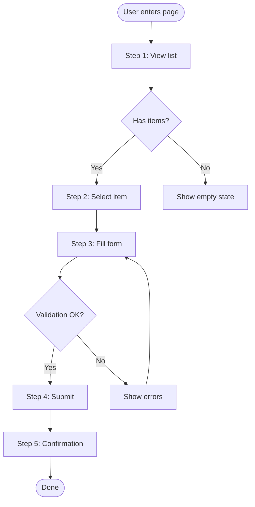
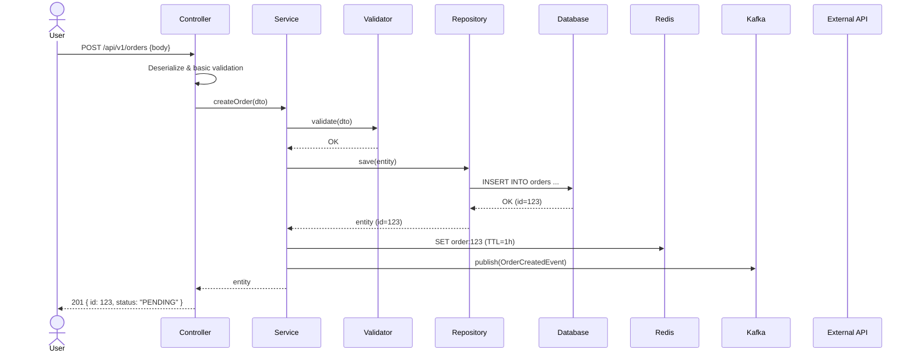
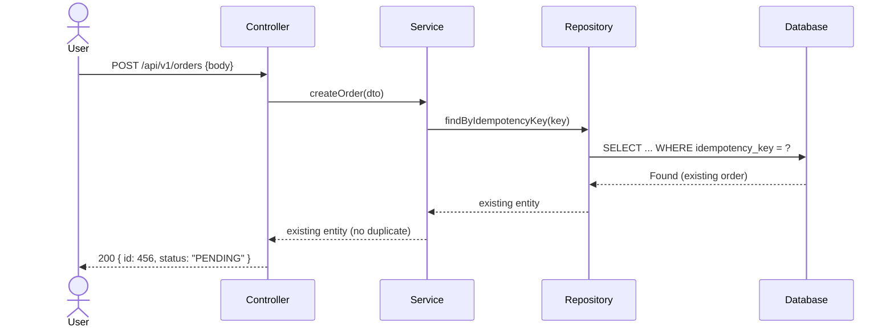
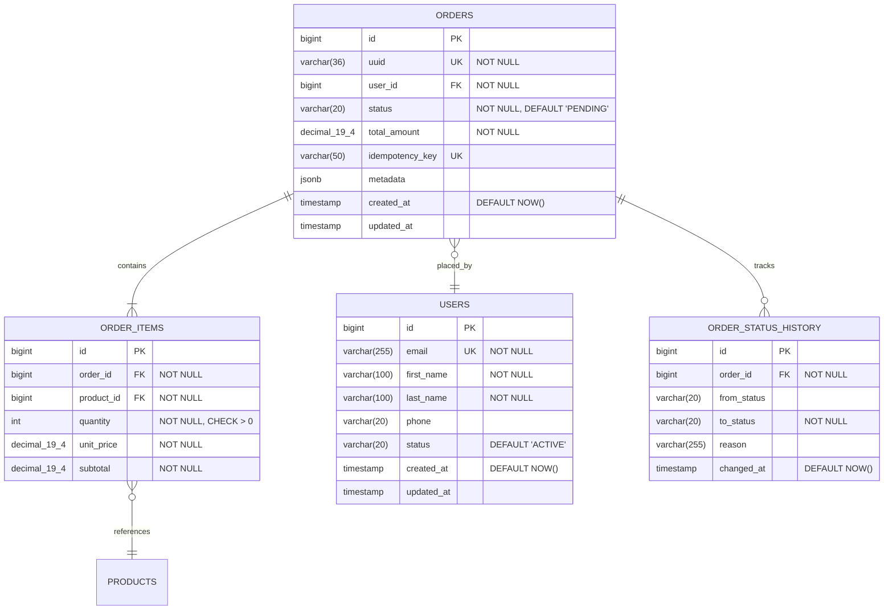

# [Tên Service] — Service Design

> **Version**: 1.0
> **Author**: [Tên]
> **Date**: YYYY-MM-DD
> **Status**: Draft | In Review | Approved
> **Solution Design**: [→ Link Solution Design](./solution-design.md)

---

> ⚠️ **NOTE**: Template này là **bộ khung tham khảo**. Khi thiết kế thực tế, tuỳ thuộc vào đặc thù của service mà *
*thêm, bớt, hoặc điều chỉnh** các sections cho phù hợp. Ví dụ: service không có async events thì bỏ phần Event/Message
> Design, service đơn giản thì gộp sections lại. Document cần **adapt** theo service thực tế, không cứng nhắc theo
> template.

---

## 1. Service Overview

### 1.1 Purpose

Service này làm gì? Giải quyết phần nào trong bài toán tổng thể?

### 1.2 Responsibilities

- Responsibility 1
- Responsibility 2
- ...

### 1.3 Boundaries (What this service does NOT do)

- ...

---

## 2. Tech Stack

| Layer          | Technology       | Version | Rationale                 |
|----------------|------------------|---------|---------------------------|
| Language       | Java             | 21      | LTS, virtual threads      |
| Framework      | Spring Boot      | 3.x     | Team expertise, ecosystem |
| Database       | PostgreSQL       | 16      | ACID, JSON support        |
| Cache          | Redis            | 7.x     | Low-latency caching       |
| Message Broker | Kafka / RabbitMQ | ...     | Async event processing    |
| Build Tool     | Gradle / Maven   | ...     | ...                       |
| Container      | Docker           | ...     | Standardized deployment   |

### 2.1 Key Libraries & Dependencies

| Library                 | Purpose       |
|-------------------------|---------------|
| Spring Data JPA / R2DBC | Data access   |
| Spring Security         | AuthN / AuthZ |
| MapStruct               | DTO mapping   |
| Flyway / Liquibase      | DB migration  |
| ...                     | ...           |

---

## 3. Use Cases (Detailed)

### UC-01: [Tên Use Case] {#uc-01}

**Overview**: _(link từ Solution Design)_

**Actor**: [Primary Actor]
**Preconditions**:

- ...

**Main Flow (Happy Path)**:
| Step | Actor | Action | System Response |
|------|-------|--------|-----------------|
| 1 | User | ... | ... |
| 2 | System | ... | ... |
| 3 | User | ... | ... |
| 4 | System | ... | ... |

**Alternative Flows**:
| ID | Condition | Steps | Outcome |
|----|-----------|-------|---------|
| AF-01 | [Condition] | ... | ... |
| AF-02 | [Condition] | ... | ... |

**Exception Flows**:
| ID | Condition | Steps | Outcome |
|----|-----------|-------|---------|
| EF-01 | [Error condition] | ... | Error response + ... |

**Postconditions**:

- ...

**Business Rules**:
| # | Rule | Description |
|---|------|-------------|
| BR-01 | ... | ... |

---

## 4. User Journeys (Detailed) {#journey-1}

### Journey 1: [Tên Journey]



**Screen-by-Screen Breakdown**:

| Step | Screen / UI  | User Action   | API Call               | Notes                      |
|------|--------------|---------------|------------------------|----------------------------|
| 1    | List page    | View          | GET /api/v1/items      | Paginated                  |
| 2    | Detail page  | Click item    | GET /api/v1/items/{id} |                            |
| 3    | Form         | Fill & submit | POST /api/v1/items     | Validate client-side first |
| 4    | Confirmation | View result   | —                      | Redirect after success     |

**Error States & Edge Cases**:
| Scenario | Behavior | UI |
|----------|----------|----|
| Network error | Retry with backoff | Toast notification |
| 401 Unauthorized | Redirect to login | Login page |
| 422 Validation | Show field errors | Inline error messages |
| 500 Server error | Show generic error | Error page |

---

## 5. Sequence Diagrams (Detailed)

### Flow 1: [Tên — e.g., Create Order]



### Flow 2: [Error Flow — e.g., Duplicate Order]



### Flow 3: [Async Consumer Flow]

_(cho các background jobs, event consumers)_

---

## 6. Database Design

### 6.1 ER Diagram



### 6.2 Table Details

#### `orders`

```sql
CREATE TABLE orders (
    id              BIGSERIAL PRIMARY KEY,
    uuid            VARCHAR(36) NOT NULL UNIQUE DEFAULT gen_random_uuid(),
    user_id         BIGINT NOT NULL REFERENCES users(id),
    status          VARCHAR(20) NOT NULL DEFAULT 'PENDING',
    total_amount    DECIMAL(19,4) NOT NULL,
    idempotency_key VARCHAR(50) UNIQUE,
    metadata        JSONB,
    created_at      TIMESTAMP NOT NULL DEFAULT NOW(),
    updated_at      TIMESTAMP,

    CONSTRAINT chk_order_status CHECK (status IN ('PENDING','CONFIRMED','PROCESSING','COMPLETED','CANCELLED'))
);
```

#### Indexes

```sql
CREATE INDEX idx_orders_user_id ON orders(user_id);
CREATE INDEX idx_orders_status ON orders(status);
CREATE INDEX idx_orders_created_at ON orders(created_at DESC);
CREATE INDEX idx_orders_user_status ON orders(user_id, status);  -- composite for common query
```

### 6.3 Data Considerations

| Aspect        | Strategy                                               |
|---------------|--------------------------------------------------------|
| Soft delete   | `deleted_at` timestamp (nullable)                      |
| Audit trail   | `created_at`, `updated_at`, `created_by`, `updated_by` |
| UUID exposure | Expose UUID externally, use BIGINT internally          |
| Partitioning  | Partition by `created_at` nếu data > 100M rows         |
| Archival      | Move records older than X months → archive table       |

### 6.4 Migration Plan

| Version | File                           | Description                 |
|---------|--------------------------------|-----------------------------|
| V001    | `V001__create_users.sql`       | Create users table          |
| V002    | `V002__create_orders.sql`      | Create orders + order_items |
| V003    | `V003__add_status_history.sql` | Add order_status_history    |

---

## 7. API Design

### 7.1 API Overview

**Base URL**: `/api/v1`
**Authentication**: Bearer JWT Token
**Content-Type**: `application/json`
**Common Headers**:
| Header | Required | Description |
|--------|----------|-------------|
| Authorization | Yes | `Bearer {token}` |
| X-Request-ID | No | Client-generated correlation ID |
| X-Idempotency-Key | Conditional | Required for POST mutations |

### 7.2 Endpoints

#### POST /api/v1/orders — Create Order

**Description**: Tạo order mới

**Request**:

```json
{
  "items": [
    {
      "product_id": "uuid-123",
      "quantity": 2
    }
  ],
  "metadata": {
    "source": "web",
    "campaign_id": "abc"
  }
}
```

**Validation Rules**:
| Field | Rule |
|-------|------|
| items | Required, non-empty array, max 50 items |
| items[].product_id | Required, valid UUID, must exist |
| items[].quantity | Required, integer, 1-999 |

**Response — 201 Created**:

```json
{
  "data": {
    "id": "uuid-456",
    "status": "PENDING",
    "items": [
      {
        "product_id": "uuid-123",
        "product_name": "Product A",
        "quantity": 2,
        "unit_price": 250000,
        "subtotal": 500000
      }
    ],
    "total_amount": 500000,
    "created_at": "2024-01-15T10:30:00Z"
  }
}
```

**Error Responses**:
| Status | Code | Description |
|--------|------|-------------|
| 400 | VALIDATION_ERROR | Invalid request body |
| 401 | UNAUTHORIZED | Missing or invalid token |
| 404 | PRODUCT_NOT_FOUND | Product ID does not exist |
| 409 | DUPLICATE_ORDER | Idempotency key already used |
| 422 | INSUFFICIENT_STOCK | Not enough stock |
| 500 | INTERNAL_ERROR | Unexpected server error |

**Error Response Format**:

```json
{
  "error": {
    "code": "VALIDATION_ERROR",
    "message": "Invalid request",
    "details": [
      {
        "field": "items[0].quantity",
        "message": "must be greater than 0"
      }
    ]
  }
}
```

---

#### GET /api/v1/orders — List Orders

**Query Parameters**:
| Param | Type | Default | Description |
|-------|------|---------|-------------|
| page | int | 0 | Page number (0-indexed) |
| size | int | 20 | Page size (max 100) |
| sort | string | created_at,desc | Sort field + direction |
| status | string | — | Filter by status |
| from | datetime | — | Filter created_at >= |
| to | datetime | — | Filter created_at <= |

**Response — 200 OK**:

```json
{
  "data": [ ... ],
  "pagination": {
    "page": 0,
    "size": 20,
    "total_elements": 150,
    "total_pages": 8
  }
}
```

---

#### GET /api/v1/orders/{id} — Get Order Detail

#### PUT /api/v1/orders/{id}/status — Update Order Status

#### DELETE /api/v1/orders/{id} — Cancel Order

_(format tương tự — mỗi endpoint 1 block)_

### 7.3 API Standards & Conventions

| Convention   | Standard                                        |
|--------------|-------------------------------------------------|
| Naming       | kebab-case cho URLs, camelCase cho JSON         |
| Pagination   | Page-based: `page`, `size`, `total_elements`    |
| Filtering    | Query params: `?status=PENDING&from=2024-01-01` |
| Sorting      | `?sort=field,asc\|desc`                         |
| Versioning   | URL path: `/api/v1/`, `/api/v2/`                |
| Error format | `{ error: { code, message, details[] } }`       |
| Date format  | ISO 8601: `2024-01-15T10:30:00Z`                |
| ID exposure  | UUID externally, BIGINT internally              |

---

## 8. Event / Message Design

_(Nếu service produce/consume events)_

### 8.1 Events Produced

| Event              | Topic          | Trigger           | Payload                                     |
|--------------------|----------------|-------------------|---------------------------------------------|
| OrderCreated       | `order.events` | After order saved | `{ orderId, userId, items[], totalAmount }` |
| OrderStatusChanged | `order.events` | Status update     | `{ orderId, fromStatus, toStatus, reason }` |

**Event Schema**:

```json
{
  "eventId": "uuid",
  "eventType": "OrderCreated",
  "timestamp": "2024-01-15T10:30:00Z",
  "version": "1.0",
  "source": "order-service",
  "data": {
    "orderId": "uuid-456",
    "userId": "uuid-789",
    "totalAmount": 500000
  }
}
```

### 8.2 Events Consumed

| Event               | Source          | Action                          | Failure Strategy |
|---------------------|-----------------|---------------------------------|------------------|
| PaymentCompleted    | payment-service | Update order status → CONFIRMED | Retry 3x → DLQ   |
| ProductPriceChanged | product-service | Recalculate pending orders      | Log + alert      |

### 8.3 Idempotency

- Consumer sử dụng `eventId` để deduplicate
- Strategy: check `processed_events` table trước khi xử lý

---

## 9. Security (Service-Level)

### 9.1 Authentication & Authorization

| Endpoint                | Auth | Roles                   |
|-------------------------|------|-------------------------|
| POST /orders            | JWT  | USER, ADMIN             |
| GET /orders             | JWT  | USER (own), ADMIN (all) |
| PUT /orders/{id}/status | JWT  | ADMIN only              |

### 9.2 Data Protection

| Data         | Classification | Protection                        |
|--------------|----------------|-----------------------------------|
| Email        | PII            | Encrypted at rest, masked in logs |
| Payment info | Sensitive      | Never stored, tokenized           |
| Order data   | Business       | Standard encryption               |

### 9.3 Input Validation & Sanitization

- All inputs validated at Controller layer
- SQL injection: parameterized queries (JPA)
- XSS: output encoding
- Rate limiting: 100 req/min per user

---

## 10. Error Handling & Resilience

### 10.1 Error Handling Strategy

| Layer          | Strategy                                                 |
|----------------|----------------------------------------------------------|
| Controller     | Global @ExceptionHandler, map to standard error response |
| Service        | Business exceptions (custom exception classes)           |
| Repository     | Translate DataAccessException → custom exceptions        |
| External calls | Circuit breaker + retry + fallback                       |

### 10.2 Resilience Patterns

| Pattern         | Implementation         | Config                                 |
|-----------------|------------------------|----------------------------------------|
| Circuit Breaker | Resilience4j           | Failure rate > 50% → open for 30s      |
| Retry           | Resilience4j           | Max 3 attempts, exponential backoff    |
| Timeout         | WebClient / RestClient | 5s connection, 10s read                |
| Bulkhead        | Thread pool            | Max 20 concurrent calls to ext service |

---

## 11. Performance & Caching

### 11.1 Caching Strategy

| Data            | Cache | TTL   | Invalidation          |
|-----------------|-------|-------|-----------------------|
| Order detail    | Redis | 1h    | On update/delete      |
| Product catalog | Redis | 15min | On price change event |
| User session    | Redis | 24h   | On logout             |

### 11.2 Query Optimization

| Query Pattern       | Optimization                      |
|---------------------|-----------------------------------|
| List orders by user | Composite index (user_id, status) |
| Search orders       | Full-text index / Elasticsearch   |
| Reporting           | Read replica                      |

---

## 12. Testing Strategy

| Type           | Scope                  | Tools                          | Coverage Target  |
|----------------|------------------------|--------------------------------|------------------|
| Unit           | Service & Util classes | JUnit 5, Mockito               | > 80%            |
| Integration    | Repository + DB        | Testcontainers                 | All repositories |
| API / Contract | Controller layer       | MockMvc, Spring Cloud Contract | All endpoints    |
| E2E            | Full flow              | Postman / REST Assured         | Critical paths   |

---

## 13. Configuration & Environment

### 13.1 Application Properties

| Property             | Dev       | Staging   | Prod      | Description       |
|----------------------|-----------|-----------|-----------|-------------------|
| server.port          | 8080      | 8080      | 8080      |                   |
| db.pool.max          | 5         | 10        | 30        | Connection pool   |
| cache.ttl            | 60s       | 5min      | 1h        | Default cache TTL |
| kafka.consumer.group | dev-order | stg-order | order-svc | Consumer group    |

### 13.2 Secrets Management

| Secret           | Source             |
|------------------|--------------------|
| DB password      | Vault / K8s Secret |
| JWT signing key  | Vault / K8s Secret |
| External API key | Vault / K8s Secret |

---

## 14. Monitoring & Observability

### 14.1 Key Metrics

| Metric                          | Type      | Alert Threshold |
|---------------------------------|-----------|-----------------|
| `http_request_duration_seconds` | Histogram | p95 > 500ms     |
| `orders_created_total`          | Counter   | —               |
| `db_connection_pool_active`     | Gauge     | > 80% pool      |
| `kafka_consumer_lag`            | Gauge     | > 1000 messages |

### 14.2 Health Check

- `/actuator/health` — liveness + readiness
- DB connectivity check
- Redis connectivity check
- Kafka broker connectivity check

### 14.3 Key Log Events

| Event                | Level | Fields                      |
|----------------------|-------|-----------------------------|
| Order created        | INFO  | orderId, userId, amount     |
| Payment failed       | WARN  | orderId, reason             |
| External API timeout | ERROR | service, endpoint, duration |

---

## 15. Open Questions & TODOs

| # | Question / TODO | Owner | Status |
|---|-----------------|-------|--------|
| 1 | ...             | ...   | Open   |

---

## Revision History

| Version | Date       | Author | Changes       |
|---------|------------|--------|---------------|
| 1.0     | YYYY-MM-DD | ...    | Initial draft |
