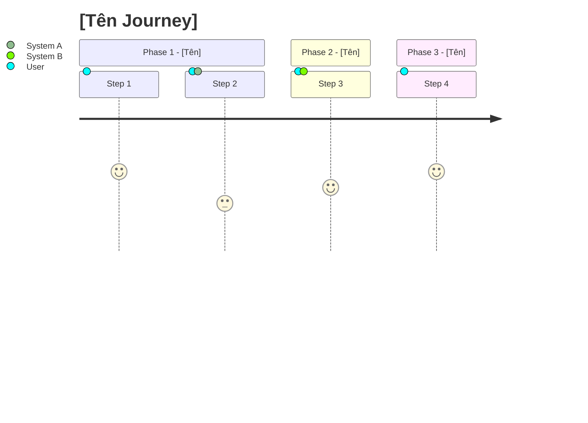
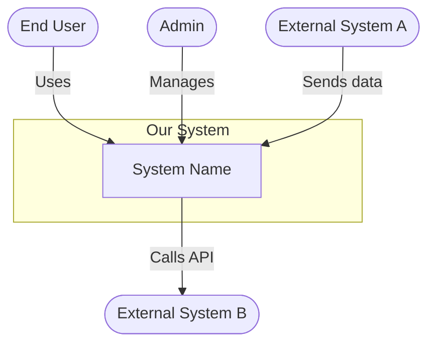
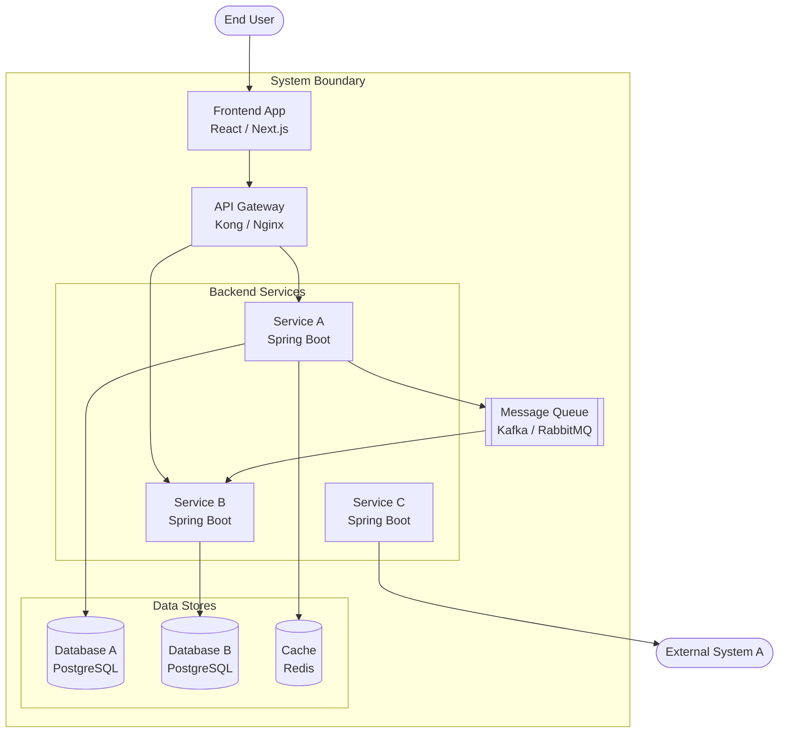
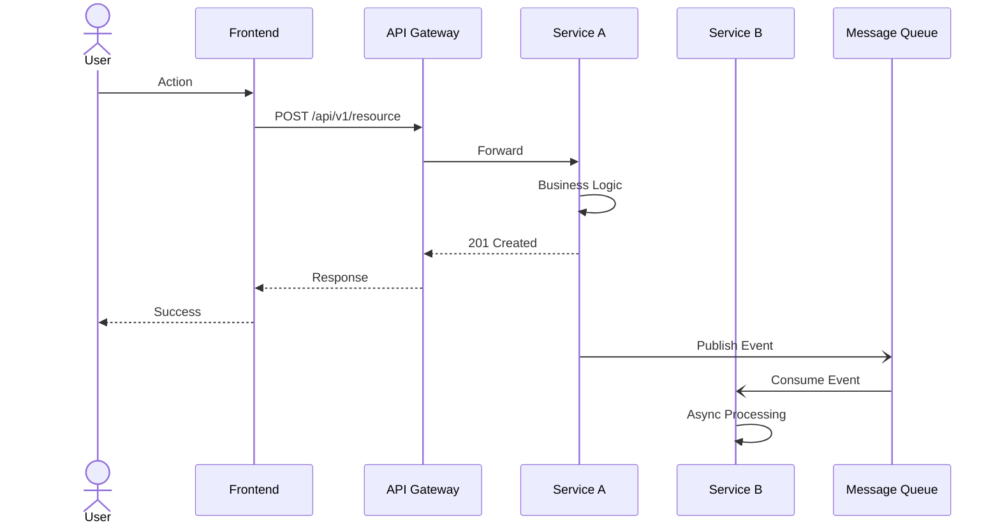

# [Tên Dự Án] — Solution Design

> **Version**: 1.0
> **Author**: [Tên]
> **Date**: YYYY-MM-DD
> **Status**: Draft | In Review | Approved
> **Reviewers**: [Danh sách]
> **Related Service Designs**: [Links tới Service Design docs]

---

> ⚠️ **NOTE**: Template này là **bộ khung tham khảo**. Khi thiết kế thực tế, tuỳ thuộc vào đặc thù của hệ thống/dự án mà
**thêm, bớt, hoặc điều chỉnh** các sections cho phù hợp. Không phải mọi section đều bắt buộc — document cần **adapt**
> theo nhu cầu thực tế, không cứng nhắc theo template.

---

## 1. Executive Summary

Mô tả ngắn gọn (3-5 câu): vấn đề gì, giải pháp gì, impact thế nào.

---

## 2. Use Cases (Overview)

Liệt kê toàn bộ use cases ở mức high-level. Chi tiết flow từng use case → xem Service Design tương ứng.

| ID    | Use Case | Actor   | Priority | Service Design                                         |
|-------|----------|---------|----------|--------------------------------------------------------|
| UC-01 | [Tên]    | [Actor] | Must     | [→ Link Service Design A](./service-a-design.md#uc-01) |
| UC-02 | [Tên]    | [Actor] | Should   | [→ Link Service Design B](./service-b-design.md#uc-02) |
| UC-03 | [Tên]    | [Actor] | Could    | [→ Link Service Design A](./service-a-design.md#uc-03) |

### UC-01: [Tên Use Case]

- **Actor**: ...
- **Description**: Mô tả ngắn mục đích của use case
- **Trigger**: Điều gì trigger flow này
- **Expected Outcome**: Kết quả mong đợi
- **Detail**: → [Service Design A — UC-01](./service-a-design.md#uc-01)

_(lặp lại cho các UC khác — chỉ mô tả overview, không đi sâu vào steps)_

---

## 3. User Journeys (Overview)

Mô tả journey tổng quan — user đi qua những touchpoints nào, hệ thống nào.

### Journey 1: [Tên Journey]



**Touchpoints**: Web / Mobile / API / Email / ...
**Services involved**: Service A, Service B, External System X
**Pain Points**: ...
**Detail**: → [Service Design A — Journey 1](./service-a-design.md#journey-1)

---

## 4. High-Level Architecture

### 5.1 System Context (C4 Level 1)

Ai / hệ thống nào tương tác với system của mình?



### 5.2 Container Diagram (C4 Level 2)

Zoom vào bên trong system — gồm những containers (services, databases, queues...) nào?



### 5.3 Service Overview

| Service   | Responsibility | Tech Stack              | Service Design                    |
|-----------|----------------|-------------------------|-----------------------------------|
| Service A | [Mô tả ngắn]   | Spring Boot, PostgreSQL | [→ Detail](./service-a-design.md) |
| Service B | [Mô tả ngắn]   | Spring Boot, PostgreSQL | [→ Detail](./service-b-design.md) |
| Service C | [Mô tả ngắn]   | Spring Boot, Redis      | [→ Detail](./service-c-design.md) |

### 5.4 Communication Patterns

| From        | To          | Protocol | Pattern | Description        |
|-------------|-------------|----------|---------|--------------------|
| Frontend    | API Gateway | HTTPS    | Sync    | REST API calls     |
| API Gateway | Service A   | HTTP     | Sync    | Request forwarding |
| Service A   | Service B   | Kafka    | Async   | Event-driven       |
| Service B   | Service C   | gRPC     | Sync    | Internal RPC       |

---

## 5. Key Sequence Diagrams (Cross-Service)

Chỉ vẽ các flow **cross-service** ở đây. Flow nội bộ từng service → xem Service Design.

### Flow 1: [Tên Flow chính — e.g., Order Placement]



### Flow 2: [Error / Compensation Flow]

_(tương tự — focus vào cross-service interaction)_

---

## 6. Non-Functional Requirements

### 7.1 Performance

| Metric              | Target     |
|---------------------|------------|
| Response time (p95) | < 200ms    |
| Throughput          | 1000 req/s |
| Concurrent users    | 10,000     |

### 7.2 Scalability

- Scaling strategy (horizontal / vertical): ...
- Expected growth: ...
- Bottleneck analysis: ...

### 7.3 Availability & Reliability

- Target uptime: 99.9%
- Failover strategy: ...
- Disaster recovery: RPO = ..., RTO = ...

### 7.4 Security (Overview)

| Aspect         | Approach                             |
|----------------|--------------------------------------|
| Authentication | JWT / OAuth 2.0 / SSO                |
| Authorization  | RBAC / ABAC                          |
| Encryption     | TLS 1.3 (transit), AES-256 (at rest) |
| API Security   | Rate limiting, input validation      |

_(Chi tiết security per service → Service Design)_

### 7.5 Observability Strategy

| Layer    | Tool                   | Description                         |
|----------|------------------------|-------------------------------------|
| Logging  | ELK / Loki             | Structured JSON, correlation ID     |
| Metrics  | Prometheus + Grafana   | Service-level metrics               |
| Tracing  | OpenTelemetry + Jaeger | Distributed tracing across services |
| Alerting | Grafana / PagerDuty    | SLO-based alerting                  |

---

## 7. Deployment & Infrastructure (Overview)

### 8.1 Deployment Topology

```
                    [CDN]
                      │
                [Load Balancer]
                      │
              ┌───────┼───────┐
              │       │       │
          [Svc A]  [Svc B]  [Svc C]   ← Auto-scaling
              │       │       │
              └───┬───┘       │
                  │           │
            [DB Primary]   [Redis]
                  │
            [DB Replica]
```

### 8.2 Environment Strategy

| Environment | Purpose                 | Infra          |
|-------------|-------------------------|----------------|
| Dev         | Development & debugging | Docker Compose |
| Staging     | Pre-production, UAT     | K8s / VM       |
| Production  | Live traffic            | K8s / VM + HA  |

### 8.3 CI/CD Pipeline (Overview)

```
Code Push → Build → Unit Test → Integration Test → Deploy Staging → E2E Test → Deploy Prod
```

---

## 8. Migration & Rollout Plan

### 9.1 Rollout Strategy

| Phase | Scope             | Timeline | Success Criteria  | Rollback Plan     |
|-------|-------------------|----------|-------------------|-------------------|
| 1     | Internal / Canary | Week 1   | No P1 bugs        | Feature flag off  |
| 2     | 10% traffic       | Week 2   | Error rate < 0.1% | Route to old      |
| 3     | 100% traffic      | Week 3   | All metrics green | Blue-green switch |

### 9.2 Data Migration

- Migration strategy: ...
- Backward compatibility: ...
- Rollback plan: ...

---

## 9. Risks & Mitigations

| # | Risk | Probability  | Impact       | Mitigation |
|---|------|--------------|--------------|------------|
| 1 | ...  | High/Med/Low | High/Med/Low | ...        |
| 2 | ...  | ...          | ...          | ...        |

---

## 10. Key Architecture Decisions

Tóm tắt decisions quan trọng. Chi tiết → ADR riêng.

| # | Decision                       | Rationale               | ADR                                           |
|---|--------------------------------|-------------------------|-----------------------------------------------|
| 1 | Chọn Kafka cho async messaging | High throughput, replay | [ADR-0001](../decisions/ADR-0001-kafka.md)    |
| 2 | PostgreSQL làm primary DB      | ACID, JSON support      | [ADR-0002](../decisions/ADR-0002-postgres.md) |

---

## 11. Open Questions

| # | Question | Owner | Status | Resolution |
|---|----------|-------|--------|------------|
| 1 | ...      | ...   | Open   | ...        |

---

## 12. References

- Service Design docs: [links]
- ADRs: [links]
- UI/UX designs: [Figma links]
- External API docs: [links]

---

## Appendix

### A. Glossary

| Term | Definition |
|------|------------|
| ...  | ...        |

### B. Document Map

```
Solution Design (this doc)
├── Service Design: Service A  → detailed design, DB, APIs
├── Service Design: Service B  → detailed design, DB, APIs
├── Service Design: Service C  → detailed design, DB, APIs
├── ADR-0001: [Decision 1]
└── ADR-0002: [Decision 2]
```

### C. Revision History

| Version | Date       | Author | Changes       |
|---------|------------|--------|---------------|
| 1.0     | YYYY-MM-DD | ...    | Initial draft |
